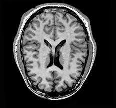
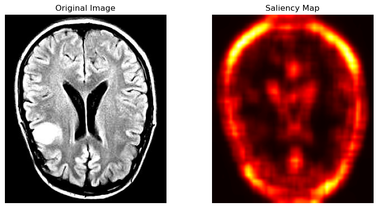

# Image-Processing-Techniques
This repository contains various image preprocessing techniques for variety of images like Brain MRI images, human face images.

### Brain MRI Image Contouring and Region Masking
Normal Brain MRI Image converted to Contoured and Region Masked MRI Image  

  
  

Saliency Map Plotting  

  

* <a href='https://github.com/dvamsidhar2002/Image-Processing-Techniques/blob/main/image%20format%20converter.py'>.NII files to .JPG converter</a>
